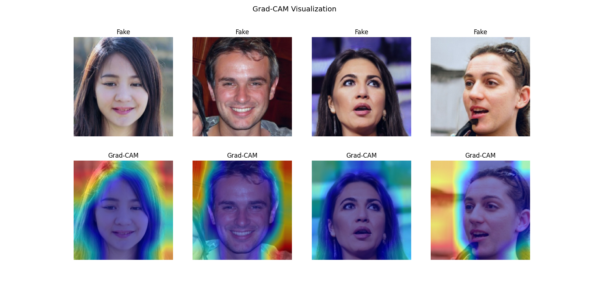
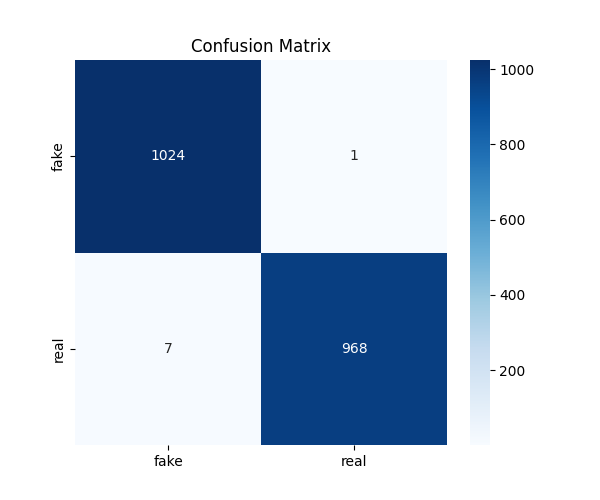
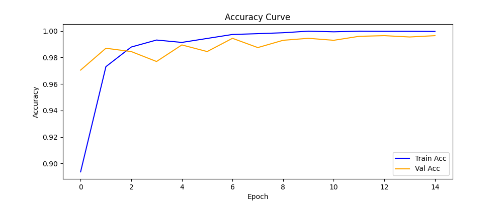
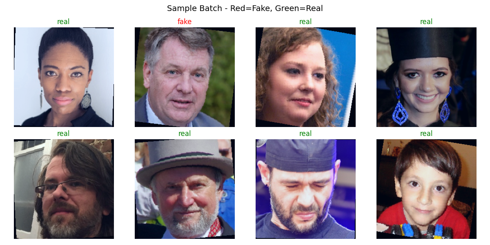

 Deepfake Detection System
A deep learning system to detect AI-generated fake faces using EfficientNet-B0.

##  Problem Statement
Deepfakes are AI-generated manipulated media that pose serious threats to digital trust. This project builds a binary classifier to detect fake vs real faces.

##  Model Architecture
- **Backbone:** EfficientNet-B0 (pretrained on ImageNet)
- **Custom Head:** Dropout → Linear → ReLU → Linear → Sigmoid
- **Framework:** PyTorch + timm

## Dataset
- [140k Real and Fake Faces](https://www.kaggle.com/datasets/xhlulu/140k-real-and-fake-faces)
- 100k training | 20k validation | 20k test images

##  Results
| Metric | Score |
|--------|-------|
| Accuracy | ~90% |
| AUC-ROC | ~0.95 |

## Result Visualizations

### Grad-CAM Visualization

### Confusion Matrix

### Training Curves

### Sample Dataset

##  Live Demo
https://samammu2908-deepfake-detection.hf.space/

##  How to Run
1. Open `deepfake_detection.ipynb` in Google Colab
2. Set runtime to T4 GPU
3. Run all cells top to bottom
4. Upload any face image to test

##  Tech Stack
- Python, PyTorch, timm
- EfficientNet-B0
- Gradio (deployment)
- Grad-CAM (visualization)
- OpenCV, Albumentations

